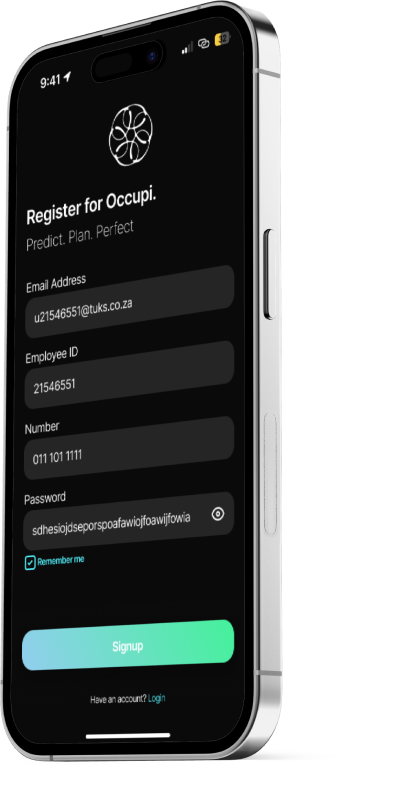
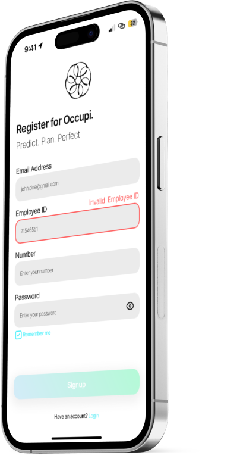

# Mobile App Renderings 📲


<div style="position: relative; display: inline-block;">
  
  
</div>

**NB: This is an [Expo](https://expo.dev) project created with [`create-expo-app`](https://www.npmjs.com/package/create-expo-app).** 🚀

## Get yourself set up for development 🛠️

1. We use bun as our package manager. Please download it at [bun](https://bun.sh/docs/installation). 📥
2. Install dependencies
   ```bash
   bun install
   ```
3. If you want to develop with a simulator, you will need to install [Android Studio](https://docs.expo.dev/workflow/android-studio-emulator/) for android development 🤖 or [Xcode (only for MacOS)](https://docs.expo.dev/workflow/ios-simulator/) for iOS development 🍎. We instead recommend using your own device as the development environment using [Expo Go](https://expo.dev/go) 📱
4. Start the app
   ```bash
   bun expo start
   ```

## Development cycle (with Expo Go) 📱

1. With the app running (`bun expo start`), use the Expo Go app on your mobile device to scan the QR code displayed in the terminal or web browser. 📷
2. Expo will automatically load the app on your device, and you can start making changes to the code. ✍️
3. When you save changes to the code, Expo will automatically refresh the app on your device, allowing you to see the updates in real-time. 🔄
4. You can use the developer menu in the Expo Go app to access debugging tools, reload the app, or perform other actions. 🔧

## Development cycle (using the Simulator) 🖥️

1. With the app running (`bun expo start`), click on the appropriate simulator option (e.g., "Run on Android device/emulator" or "Run on iOS simulator") in the terminal or web browser. 🖥️
2. Expo will launch the appropriate simulator (Android Studio or Xcode) and load the app. 🌐
3. When you make changes to the code and save, Expo will automatically refresh the app in the simulator, allowing you to see the updates in real-time. 🔄
4. You can use the developer menu in the simulator to access debugging tools, reload the app, or perform other actions. 🔧

## Learn more 📚

To learn more about developing your project with Expo, look at the following resources:

- [Expo documentation](https://docs.expo.dev/): Learn fundamentals, or go into advanced topics with our [guides](https://docs.expo.dev/guides). 📖
- [Learn Expo tutorial](https://docs.expo.dev/tutorial/introduction/): Follow a step-by-step tutorial where you'll create a project that runs on Android, iOS, and the web. 🎓